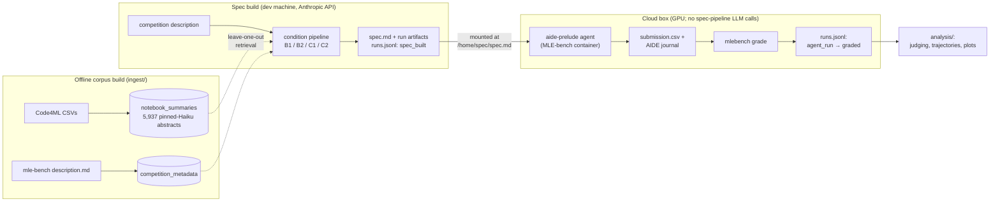

# Prelude — Research Design

*v1 scope. Drafted July 2026, before any evaluation run. Amendments after
runs begin must be dated and listed at the bottom.*

This document states the **current design** and the limitations bounding its
claims. How the design got here — dated changes and rejected alternatives —
is in [DECISIONS.md](DECISIONS.md).

- [Research question and hypothesis](#research-question-and-hypothesis)
  - [What v1 establishes, and what it does not](#what-v1-establishes-and-what-it-does-not)
- [Related work positioning](#related-work-positioning)
- [System overview](#system-overview)
- [Experimental design](#experimental-design)
  - [Staged pipeline](#staged-pipeline--queries-prompts-schemas)
  - [Illustrative output](#illustrative-output)
- [Corpus construction](#corpus-construction)
- [Outcome metrics](#outcome-metrics-defined-in-advance)
- [Mechanistic evaluation](#mechanistic-evaluation)
- [Threats to validity](#threats-to-validity)
- [Roadmap](#roadmap)
- [Amendments](#amendments)

## Research question and hypothesis

**Question:** Does structured reasoning over retrieved prior work improve ML
agent performance on benchmark tasks beyond what unstructured knowledge
provision achieves?

**H1 (outcome):** On MLE-bench Lite competitions, an AIDE
agent given Condition C2's structured specification will achieve a higher
Any-Medal rate than the same agent given Condition B's unstructured context.
H1 is falsified if C2 fails to separate from B beyond seed noise, or if
unstructured provision alone matches structured specification. *(Amended
2026-07-16, pre-run: H1 originally referenced the published no-assistance
baseline (A); that comparison is invalid because the published AIDE runs
used gpt-4o-2024-08-06, not our agent model — see the Condition A note
under the experimental design.)*

**H2 (mechanism):** C2's specification flags are acted on by the agent above the
rate at which unconditioned solutions address the same mechanisms, and that
effect varies systematically by flag category; flags recorded as acted on are
associated with better outcomes than flags recorded as not acted on.

*Base-rate counterfactual (added 2026-08-25, pre-run).* An action rate alone is
uninterpretable, because some mechanisms are addressed by competent default
practice whether or not anything flagged them. Each C2 run's flag set is
therefore judged a second time against the paired **B2** solution for the same
competition and seed, the flag unchanged and only the solution differing, giving

    P(addressed | spec delivered)       from the C2 run
    P(addressed | spec not delivered)   from the paired B2 run

**Estimand.** The unit is a (competition, flag) pair; treatment is receiving
C2's specification; the outcome is the rubric's binary action class. The paired
difference is the average treatment effect on whether the mechanism was
addressed, and the per-category breakdown is the corresponding CATE with flag
category as the conditioning variable, so the heterogeneity clause above is a
treatment-effect-heterogeneity claim rather than a descriptive one. This costs
judge calls only, no additional agent runs, since it reuses runs already in the
grid. The judge is condition-blind (docs/JUDGE_RUBRIC.md), so it cannot know
which side of the comparison a solution came from.

**Confirmatory control is B2; B1 and C1 are descriptive.** B2 is the
pre-registered control because it is the headline contrast and it keeps the
human anchor at two conditions. B1 and C1 are judged the same way and reported
as a gradient — action rate against increasing spec structure — carrying no
separation criterion, because a monotonic trend across four arms cannot be
established at 3–5 competitions. Condition-blind judging is what licenses
applying the instrument to arms the human anchor did not cover: the judge cannot
behave differently by condition when it cannot see the condition.

**Two properties of the estimand that bound what may be claimed.** The treatment
is *compound*: C2 delivers its flags inside a longer, more structured document,
so what is identified is the effect of receiving C2's spec, not of any isolated
flag. Separating content from format is the negative-control arm's job (v1.5).
And flag observations are *clustered within runs* — one spec delivers many
flags, and the agent's response to one may not be independent of the others — so
the effective sample size is competitions, not flags. The bootstrap resamples
competitions accordingly, and a flag-level count must never be reported as
though it were an independent n.

*Scope limit (revised 2026-08-25, pre-run; supersedes the 2026-08-11 note that
scoped H2 within-C2).* The base rate is not a measure of whether B2's *prose
advice* was followed; that remains unmeasurable, since the rubric classifies
flags and B2 has none. The earlier note conflated the two questions. What the
counterfactual establishes is narrower and still useful: the rate at which the
flagged mechanisms are addressed absent the specification.

*What this deliberately does not attempt.* Per-flag causal attribution by
tracing AIDE's node lineage. Lineage records how the agent responded to its own
prior results, which is credit assignment over a reward signal and answers a
different causal question than H2 asks; its depth also varies with search-tree
shape rather than with agent behavior, so evidence volume would differ between
otherwise identical flags. Causal purchase here comes from between-condition
comparison under the design, not from reconstructing why any single instance
occurred.

**H3 (efficiency, added 2026-08-13, pre-run):** Front-loading specification
effort directs the agent's search, so conditioned runs converge faster than
unconditioned ones. H3 concerns the *path* where H1 concerns the endpoint.
Prelude does not replace the agent's iterative search, it initializes it, so what
is tested is directed against undirected iteration, not upfront reasoning against
iterative feedback. H3 is not supported if conditioned runs show no convergence
advantage at matched step counts. A specification can plausibly slow a run, since
it adds context to process and a wrong steer costs steps to recover from, so a
negative result is informative about when front-loading fails rather than merely
null. Measurement is defined under Outcome metrics.

### What v1 establishes, and what it does not

One distinction governs how every result below should be read. Some limits are
**by design** and hold at any scale. Others exist only because the POC runs too
few trials to support statistical conclusions, and a larger round removes them.

v1 does not claim its results will be representative of the outcomes a full run
would produce. It claims that the experiment functions as intended and produces
the data needed to evaluate the research questions properly. Concretely: the full
artifact chain runs end to end (specs, agent runs, gradings, judgments, a
reproducible analysis), the invariants hold under real conditions (leave-one-out,
document parity, blinded judging), and the outputs are the ones the hypotheses
actually require.

Threats to validity labels each limitation as structural or POC-scale for this
reason. Conflating the two would either overstate what a bigger experiment fixes
or understate what this design can support.

*Corroborating prior evidence (suggestive, not validating):* DS-Agent's
development-stage ablation found retrieval-augmented CBR beat its
no-retrieval variant, and iterative case revision beat one-shot CBR — best
rank 2.08 (CBR with feedback revision) vs 2.58 (CBR without) vs 3.41 (no
retrieval), across 12 tasks, their Table 2. This is consistent with H1's
basic premise that retrieved practitioner knowledge helps. It is only
suggestive, not validation: DS-Agent works by a different mechanism
(iterative case revision against execution feedback, vs Prelude's one-shot
upfront spec) and on a much smaller, easier task set than MLE-bench Lite.

## Related work positioning

- **MLE-bench** (OpenAI, ICLR 2025): evaluation infrastructure and the
  Condition A baseline. Measures agent capability; does not study what
  knowledge or specification the agent starts with.
- **AssistedDS** (EMNLP 2025): showed LLMs adopt provided unstructured
  knowledge uncritically. Defines Condition B's design; does not test
  structured alternatives.
- **CatDB** (VLDB 2025): closest analog — catalog-grounded data-science
  automation. Assumes a populated catalog; does not address reasoning about
  unknown/missing signals, and provides no staged specification process.
- **DS-Agent** (Guo et al., ICML 2024): case-based reasoning framework that
  retrieves whole solved Kaggle cases and iteratively revises them against
  execution feedback. Closer prior art than AssistedDS/CatDB — directly
  retrieves practitioner Kaggle solutions, similar to Prelude's corpus. Key
  difference: DS-Agent's retrieval is revised iteratively against execution
  feedback in a CBR loop; Prelude's spec is built once, upfront, before the
  agent's own search begins.
- **MLE-Dojo** (Qiang et al., May 2025): interactive Gym-style benchmark
  environment built on 200+ Kaggle competitions, supporting SFT/RL agent
  training. Different axis from Prelude — an alternative/broader execution
  environment and training framework, not a study of what specification or
  knowledge an agent starts with. Cite for scope contrast, not as directly
  competing work.
- **Yang et al. 2023, "LLMs as Optimizers":** conceptual grounding for
  prompt-level structured reasoning; not applied to ML problem
  specification.
- **Co-Scientist** (Gottweis, Natarajan, et al., *Nature*, 2026; Google
  DeepMind): *independent convergence in an adjacent domain, not prior art.*
  A multi-agent system that generates and refines scientific hypotheses for
  researchers to test, validated in wet-lab collaborations. It reflects the
  same core conviction as Prelude, reached independently: that problem
  understanding and hypothesis formation deserve a structured phase before the
  solution phase. A shared premise, not a shared architecture — cited as a
  signal the premise is an active frontier question, not as transferable
  technique.

## System overview



The spec pipeline (left, laptop) and agent execution (right, cloud box)
never share a runtime: specs are serialized text by the time they reach the
container (core constraint 1). The append-only registry is the join —
spec-time entries from the dev machine, agent/grading entries from the box,
merged per run_key.

## Experimental design

Five conditions, structured as a 2 (retrieval: flat vs staged) × 3
(synthesis: none vs freeform vs structured-critical) grid with three cells
built plus one grid-external anchor:

| Condition | Retrieval | Synthesis | Isolates (vs) |
|---|---|---|---|
| A | none | none | no-assistance anchor — matched agent (see note) |
| B1 | flat, single query | none — raw context block | knowledge provision per se (vs A) |
| B2 | flat, single query | freeform, stance-free | LLM preprocessing (vs B1) |
| C1 | staged, 4 directed queries | freeform, stance-free (B2's path) | staged retrieval (vs B2) |
| C2 | staged, 4 directed queries | structured schemas + critical-integration stance | synthesis structure (vs C1) |

Per-condition workflow — every arrow into a spec is one grid step's single
change:


### Staged pipeline — queries, prompts, schemas

C decomposes spec-building into four stages. **parse** extracts the problem's ML
structure (`task_type`, `evaluation_metric`, `goal`) from the raw description —
this runs in **both** C1 and C2, since the directed queries must be built from
something. **surface**, **flag**, and **advise** then each retrieve with a query
built from those extracted fields (Table 1). C1 and C2 run this identical staged
retrieval; they differ only in synthesis (Table 2): **C2** keeps every stage's
output as a typed schema, while **C1** keeps none of it — it pools the four
retrieved blocks into one freeform pass (B2's style: no schema, no stance), over
staged rather than flat retrieval. B retrieves everything with one flat
`raw_problem` query and, in B2, one freeform pass.

**Table 1 — staged retrieval** (run identically by C1 and C2). Query text is the
verbatim string embedded for similarity search — `flag` and `advise` prepend a
fixed phrase to the `{task_type} {evaluation_metric} {goal}` fields `parse`
extracted; `parse` queries with the raw description. Sample hit is the top
retrieval for `random-acts-of-pizza` (other competitions only, leave-one-out;
cosine similarity in parens) — the directed queries pull different, on-target
material. (Hits below are from the pre-2026-08-03 code-chunk retrieval, retained
as an illustration of query targeting; they will be regenerated against the
notebook-summary corpus before eval runs — see DECISIONS.md.)

| Stage | Query text | Query target | Sample hit |
|---|---|---|---|
| **parse** | the raw competition description | descriptions of similar past competitions | `ml1819-whats-cooking?` (0.65) — a competition description |
| **surface** | `{task_type} {evaluation_metric} {goal}` | data signals and prior work practitioners used | `jigsaw-toxic-comment` (0.55) — `roc_curve` / `roc_auc_score` evaluation code |
| **flag** | `validation leakage overfitting pitfalls {task_type} {evaluation_metric} {goal}` | validation / leakage / overfitting patterns | `siim-isic-melanoma` (0.58) — leaderboard-probing (`known positive set to 1, rest 0`) |
| **advise** | `model architecture training approach {task_type} {evaluation_metric} {goal}` | modeling approaches for the metric | `jigsaw-toxic-comment` (0.64) — a Keras text-model pipeline |

**Table 2 — C2 structured synthesis** (C2 only). Each stage is a
schema-constrained LLM call whose output is preserved in the spec (sample output
from the random-acts run). B2 and C1 produce **none** of this per-stage
structure — they collapse the retrieval into a single freeform prose pass (the
format contrast is visible under Illustrative output); C1 uses `parse`'s
extraction only to build the Table 1 queries.

| Stage | Prompt produces | Schema | Sample output |
|---|---|---|---|
| **parse** | goal, task type, evaluation metric, target variable, framing (causal / predictive / descriptive / ambiguous), constraints | `ParsedProblem` | task = binary classification; metric = ROC-AUC; target = `requester_received_pizza`; framing = predictive |
| **surface** | available signals; signals that would help but are missing; relevant prior work | `SurfacedSignals` | available: `request_text_content`, `request_text_length`; missing: `user_previous_success_rate` |
| **flag** | assumption violations, each a typed `category` + `confidence` + `evidence_doc_ids` | `AssumptionFlags` (list of `SpecificationFlag`) | `[F0] outcome_measurement_gap` (high) — success label not observable in the available signals |
| **advise** | concrete approaches, each a `tradeoff` + `failure_mode` + `addresses_flags` | `Advice` (list of `Recommendation`) | calibration-focused Bi-GRU/XGBoost + post-hoc calibration — addresses F0 |

Two prompt details worth making explicit:

- **Shared critical stance, C2 only.** Every C2 stage prompt appends
  `RETRIEVAL_STANCE`: retrieved excerpts are *"evidence of past practice, not a
  boundary on your reasoning … explicitly disregard excerpts that are
  irrelevant, outdated, or low quality."* B2 and C1 synthesis is deliberately
  stance-free — uncritical adoption is the AssistedDS failure mode those
  conditions must be free to exhibit (CLAUDE.md constraint 6).
- **Honest grounding, not forced citation.** The flag prompt instructs: *"cite a
  document only if it genuinely shaped the flag; a flag drawn from your general
  knowledge should honestly report an empty `evidence_doc_ids` list — that is a
  valid and expected answer, not a failure."* So an empty `evidence_doc_ids` is
  a truthful "this came from model priors," not a defect — read the
  retrieval-grounded fraction with that in mind.

### Illustrative output

The four injected artifacts on one competition, showing the additive design —
each step changes exactly one variable. *Built with the Haiku **dev** model on
`random-acts-of-pizza` (the off-eval smoke competition); illustrative only, not
an eval result — eval runs use the pinned Sonnet `EVAL_MODEL`. Excerpts are
truncated/reflowed for readability. Document budget (count of retrieved docs) is
parity-matched across all four; what varies is how they are retrieved and what
synthesis sits on top.*

**B1** — the raw retrieved block, verbatim, nothing on top:

```
[code4ml_homework-for-students_0 | competition_description]
'Feature Engineering  Build Models  Submission  Notebooks  csv  Kernel ...'
  ... top-k notebook summaries + competition descriptions, flat single query
```

**B2** ( = B1 + synthesis) — same flat block plus a stance-free advice pass.
Prose the agent may adopt uncritically — the AssistedDS failure mode B exists to
exhibit:

```
## Advisor notes
### Feature Engineering Strategy
Linguistic features (high ROI): word/character counts, punctuation patterns,
capitalization stats, sentiment indicators, readability metrics ...
```

**C1** ( = B2 with staged retrieval) — same freeform advice format, but the
block is now pulled by four *directed* queries instead of one flat query.
Isolates the effect of retrieval structure:

```
## Advisor notes
## 1. Problem Understanding
This is a binary classification problem ... The key insight: this isn't purely
NLP — you have rich metadata that correlates with altruistic behavior.
```

**C2** ( = C1 with structured synthesis) — staged retrieval, but the freeform
prose is replaced by typed, confidence-rated assumption flags, each linked to a
concrete recommendation. Isolates the effect of output structure:

```
[F0] outcome_measurement_gap   (confidence: high)
  The ground-truth label (successful pizza receipt) is not observable in the
  available signals — only request metadata and user history exist.

→ recommendation (addresses F0): calibration-focused model — Bi-GRU/XGBoost,
  then post-hoc Platt/isotonic scaling to output calibrated probabilities.
```

The B2→C1 step changes retrieval (flat → directed); the C1→C2 step changes
synthesis (freeform prose → structured flags + linked mitigations). C2's flags
are categorized and confidence-rated, and recommendations cite the `flag_id`s
they address — the structure whose downstream effect this POC measures.

Design notes:

- **Condition A (pre-registered 2026-08-25, pre-run):** a primary arm, run at
  every eval competition and seed. `aide-prelude` with no spec mounted is stock
  AIDE and requires no new code, inheriting the same agent model, hardware,
  budget, and mle-bench version as every other condition in the grid.

  It supplies the bottom rung of the decomposition ladder. B1's isolated
  variable is knowledge provision per se, which is defined against A; without A
  that contrast has no partner. More consequentially, A is what makes the null
  case readable: if C2, B2 and B1 all land together, only A distinguishes
  "structure does not help" from "every condition is worse than no
  specification at all". The headline claim does not rest on it — the powered
  contrast is C2 vs B2, and H1 is stated relative to unstructured provision
  rather than to nothing — but without A one plausible outcome of the grid is
  uninterpretable rather than merely unpowered.

  The published MLE-bench AIDE baseline is **not cited as a comparison** in
  either direction. It carries two independent mismatches: a different code
  model (`gpt-4o-2024-08-06`), and MLE-bench's reference budget where this grid
  runs at a reduced one. Neither a statistical nor a directional reading of it
  is admissible here; A is the only no-assistance anchor this design uses.

  Infrastructure smoke runs (RUNBOOK step 4) are not A data points: they use
  the 8-step `dev` variant on a held-out off-eval competition and are throwaway
  integration checks, at a budget far too short to be a valid A run.
- **Retrieval unit held constant.** All conditions receive practitioner
  knowledge as **notebook summaries** (one LLM abstract per notebook) plus
  flat competition-metadata chunks. B retrieves summaries with one flat query;
  C1/C2 with three stage-directed queries. This confines the flat-vs-staged
  contrast to query structure rather than retrieval granularity. (The retrieval
  unit was code chunks until a 2026-08-03 probe found the rich summary already
  carries the transferable content — see DECISIONS.md.)
- **Document budgets parity-matched on distinct documents** via
  `pipeline/config.py`: B and C reason over the same number of distinct notebook
  summaries (`BASELINE_N_NOTEBOOKS` = 3 × `STAGE_N_NOTEBOOKS`), C reaching it via
  cross-stage top-up (repeats retained as an importance signal, backfilled with
  the next-best unseen summary). Parity is on distinct docs, not tokens; the
  token asymmetry from retained repeats is logged, not equalized. Exact values
  are calibration parameters, not design constants.
- **C1 holds synthesis at B2's level.** Its staged retrieval feeds a single
  freeform, stance-free pass (no schema, no `RETRIEVAL_STANCE`), so the only
  change from B2 is flat → staged retrieval — see the staged-pipeline tables
  above.
- **C1 is a pilot condition, and what it can claim is limited accordingly.**
  It runs on 3–4 competitions at a single seed, not the full matrix. The code
  is built to run at full scale and the harness simply defaults to the pilot
  subset. The grid above isolates retrieval structure (B2 vs C1) and synthesis
  structure (C1 vs C2) as separate variables *in principle*, but at one seed
  C1 cannot statistically separate from either neighbor. This is a power
  limitation, not a design flaw, and the claims are scoped to match it. The
  powered contrast in v1 is **C2 vs B2**, which moves structured synthesis and
  staged retrieval together against flat retrieval with freeform synthesis.
  The C1 pilot is a *qualitative decomposition aid* that indicates which of
  the two mechanisms is worth powering in v1.5. Any decomposition read off a
  single seed is a hypothesis for the next round, not a result.
- AIDE scaffold, agent model, and MLE-bench grading are held constant across
  all run conditions (A/B/C). This constancy is what makes the matched-A
  baseline valid and the B-vs-C contrast clean: the only manipulated variable
  across the grid is the injected spec. **Condition A guardrail:** A must use
  this same pinned agent (the shared `aide-prelude` image, no spec mounted) —
  never re-matched to a published external baseline, which is the model
  mismatch the H1 amendment corrected.
- **Two model roles, pinned separately (a deliberate advisor/executor
  split).** The *spec pipeline* — C's staged retrieval, decomposition, and
  opinionated recommendations — runs on `EVAL_MODEL = claude-sonnet-5`
  (`pipeline/config.py`, pinned 2026-07-19), a strong reasoner; its output is
  identical whether the downstream agent is weak or strong. The *AIDE agent*
  that consumes the injected spec runs on `claude-haiku-4-5-20251001`
  (resolved 2026-07-22). Using different models for "author the specification"
  and "implement against it" is a standard, realistic architecture, not a
  compromise — and both models are held constant across A/B/C, so the split
  cannot confound the B-vs-C comparison. The agent-model choice therefore
  bears **only on the secondary (downstream MLE-bench) signal**, never on the
  primary mechanistic spec-quality judging, which scores the specs directly
  and is agent-independent.
- **Why Haiku for the agent (2026-07-22).** The pinned agent is
  `thesofakillers/aideml@v6.3.3` (mle-bench's designated fork, 2024), which
  cannot drive the current top models unmodified: the 5-family and Opus
  4.7/4.8 removed the `temperature` parameter aideml always sends (HTTP 400),
  and Sonnet 5 defaults adaptive thinking ON when `thinking` is omitted, so
  its responses carry a thinking block that trips aideml's single-text-block
  assertion. Haiku 4.5 (prior generation) accepts `temperature` and returns a
  single text block, so aideml's code path runs unmodified. Two non-algorithmic
  fixes are applied (verified end-to-end on-box 2026-07-23): an httpx<0.28
  environment pin, and a completion of aideml's Anthropic backend — upstream
  left the function-calling (`func_spec`) path as `NotImplementedError` (which
  is why mle-bench's own aide/claude pairs an Anthropic code model with a gpt-4o
  feedback model), so the AIDE review step is implemented via Anthropic tool use
  to reach parity with aideml's OpenAI backend, keeping the run single-provider
  on Claude. Haiku keeps the strongest fidelity story and the lowest per-run cost.
- **Agent capability × structure is a generalizability caveat, not a
  confound.** The downstream C-vs-B gap is measured at Haiku's capability
  point; whether that gap widens or narrows with a stronger agent is
  theoretically ambiguous (structure-substitution at the strong end vs
  execution-gating at the weak end) and is **future work** — a capability
  sweep (Haiku → Sonnet-5-thinking-off → Sonnet-5-thinking-on) directly probes
  it. The Sonnet-5 path is a bounded one-switch adapter (`thinking: disabled`
  + drop `temperature`), reserved for that sweep, not the default arm.

## Corpus construction

- **Current corpus (rebuilt 2026-08-17):** Code4ML filtered to notebooks with a
  positive `kaggle_score` — the available evidence that a notebook produced a
  real submission — giving a `notebook_summaries` collection of **25,633
  abstracts across 580 competitions** (one pinned-Haiku summary per notebook,
  distilling its cell-level code blocks) as the practitioner-knowledge
  retrieval unit, plus 1,005 competition-metadata chunks (936 Code4ML
  descriptions + 22 mle-bench `description.md`, 11 competitions appearing in
  both). The score filter cut 107,524 notebooks over 12,729 competitions down to
  this slice; 220 competitions carry ≥10 scored notebooks and 113 carry ≥50,
  against 18 in the superseded Lite-22 dev corpus. Summaries are corpus
  infrastructure, generated by a pinned model (Haiku, `summary_model` stamped in
  metadata) shared identically across all conditions — exempt from the
  Haiku-dev/Sonnet-eval switch because summary quality affects retrieval
  uniformly and cannot confound between-condition comparisons. Rebuild verified:
  homogeneous `summary_model`, zero batch errors, median 313 words, no degenerate
  documents.
- **Composition, described rather than corrected.** Two skews are known and
  deliberately retained. Roughly a quarter of sampled competitions outside
  Lite-22 are coursework rather than competitive work; and the corpus is
  concentrated in Kaggle's onboarding tutorials — titanic (1,865),
  digit-recognizer (1,298), house-prices (1,009), home-data-for-ml-course (930)
  and nlp-getting-started (718) together supply 5,820 notebooks, 23% of the
  corpus, none of them eval competitions and so never removed by leave-one-out.
  Both follow from the decision to apply no substance filter beyond the score
  threshold: a corpus containing thin and near-duplicate documents alongside
  rich ones is what a production knowledge base looks like, and is where
  critical weighting of retrieved evidence has something to do. Whether the
  tutorial concentration actually dominates top-k is a retrieval question, and
  is reported by the diversity characterization rather than assumed either way.
  Sources evaluated and not adopted are recorded in DECISIONS.md (2026-08-11).
- **Leave-one-out:** every retrieval carries
  `competition_id != current_competition`, enforced inside the retrieval
  seam (`pipeline/retriever.py`); retrieval is over notebook summaries and
  competition-metadata chunks, so the filter excludes the current competition's
  own artifacts directly. A code path bypassing this filter is solution leakage
  (CLAUDE.md core constraint 5).
- **Two document classes, and what they stand for (2026-08-17).** The corpus
  holds solution artifacts (`notebook_summaries`) and problem-scoping artifacts
  (`competition_metadata`). Both classes exist in real institutional knowledge
  bases: notebooks map onto internal analyses, prior model work, and
  postmortems; competition descriptions map onto project briefs, scoping docs,
  model-card intended-use sections, and ML intake tickets. They are distinct
  classes in production for the same reason they are here — written at a
  different time, by different people, for a different purpose than the solution
  write-up. A heterogeneous corpus is therefore *more* faithful to the
  generalization target than a single-class one, since institutional knowledge is
  heterogeneous by document class.

  Every condition draws from **both** classes, in equal amounts: `METADATA_K`
  scoping documents plus `BASELINE_N_NOTEBOOKS` distinct solution documents.
  What differs is arrival — B takes both in one flat pass, while the staged
  conditions take scoping documents at parse and solution documents across
  surface/flag/advise. That difference *is* the treatment; the class mix is a
  held constant.

  Two simplifications are deliberate and stated rather than hidden. (1) The
  classes live in **separate indices** where production would use one. This is a
  control, not an oversight: a single index would let ranking dynamics *between*
  document classes vary across conditions, turning part of the measured effect
  into a retrieval-ranking artifact. Separate indices hold the mix fixed, so the
  contrast isolates the mechanistic impact of staging. (2) Retrieval is **routed
  by document class** rather than by relevance, and in the staged conditions that
  routing is also per-stage. Whether parse is the right stage to spend scoping
  documents on is untested, and is a roadmapped ablation.

  What the scoping class uniquely provides: problems **as posed**, gaps and
  ambiguities intact. A notebook summary describes a problem **as solved**, by
  someone who has already resolved the ambiguity. Noticing what a specification
  omits requires a reference distribution of how such problems are normally
  specified, and only the scoping class supplies it.
- **Summary-unit rationale:** the retrieval unit is the notebook summary — a
  notebook is an approach, and a rich whole-notebook abstract carries the
  transferable content (models, feature engineering, validation, pitfalls),
  whereas flat code-chunk retrieval returned decontextualized, often
  boilerplate-heavy fragments that matched a natural-language problem statement
  weakly. A 2026-08-03 probe (`analysis/probe_representation.py`; see
  DECISIONS.md) found curated code cells added little over the summary at
  multiples of the token cost.

## Outcome metrics (defined in advance)

Each measure is defined once, under the hypothesis it serves.

**H1 (outcome).** What the agent finally achieved.
- *Headline:* Any-Medal rate (MLE-bench grading). The MLE-bench delta is a
  conservative lower bound, for the reasons under construct validity.
- *Higher resolution:* leaderboard percentile of the final submission, and
  valid-submission rate (fraction of runs producing a gradeable submission).
  These carry more information per run than a binary medal and guard against a
  medal difference that is really threshold luck. The percentile — the fraction
  of leaderboard teams the submission beats, direction-aware so higher is always
  better — is not in mle-bench's grading report and is computed by the batch
  driver at grade time. The reference distribution is the static snapshot of the
  historical Kaggle leaderboard that mle-bench ships per competition; nothing is
  submitted to Kaggle and grading is entirely local, so a percentile states where
  a run's score *would* have placed among those teams. Because that snapshot is a
  git-lfs file inside the mle-bench checkout, which exists only on the cloud box,
  each leaderboard is copied onto the results root on first use — otherwise the
  measure is computable exactly once and cannot be re-derived or audited after
  the instance is destroyed.

**H2 (mechanism).** Whether C2's flags reached the agent's behavior. Measured by
per-flag judging against the frozen rubric, aggregated per category; see
Mechanistic evaluation below for the instrument and Judge validation for the
human anchor.

**H3 (efficiency, added 2026-08-13, pre-run).** How fast the agent converged.
Compared paired within competition, where both conditions run the same agent on
the same data under the same metric and budget, so no normalization is needed.
Aggregation across competitions uses a scale-free statistic:
- *Headline:* for each (competition, seed) pair, the step at which the
  conditioned run first reaches the unconditioned run's **final validation
  score**, reported as `steps_to_match / steps_baseline_total`. Below 1 means
  faster convergence. Direction-agnostic via the registry's `is_lower_better`.
  Anchoring to the baseline's own final score avoids inventing a maximum, which
  does not exist for unbounded metrics such as RMSE. Runs that never reach the
  baseline score are not missing data; they are reported separately as a
  matched-at-all rate.
- *Supporting:* steps to first valid submission, with agent wall-clock and
  time-to-first-valid-submission secondary. Steps lead because wall-clock varies
  with data size, with whichever model the agent happens to try, and with GPU
  contention, none of which reflect search efficiency.
- *Descriptive, added 2026-08-24 pre-run:* steps and time to the run's **best**
  validation score, the pair to first-valid — first-valid is how fast the agent
  reached something that works, best is how fast it reached the best thing it
  found. Both summarize the per-step score curve already collected below, so
  this introduces no new comparison, and it carries no separation criterion.
  Read it as censored: under a fixed step budget "best" is best-so-far, biased
  toward runs that happened to peak early.
- *Timing anchor.* All elapsed measures run from the first LLM call, recorded in
  the token side-channel, to the milestone node's completion (`ctime +
  exec_time`). AIDE stamps a node's `ctime` when its drafting call *returns*, so
  the journal alone cannot see the first draft: measuring from the earliest
  `ctime` reports exactly 0.0 whenever node 0 is already valid, which is the
  outcome a good spec is most likely to produce and the case this hypothesis most
  needs to resolve. Each run records which anchor was available.
- *Cost, deliberately not the headline:* spec-build cost against agent cost is
  reported but does not carry the claim. It depends on the model pair and on GPU
  rental pricing, both environment-specific and liable to date, and the
  step-based measures already capture the efficiency it proxies for.
- *Validation, not test:* the per-step metric in AIDE's journal is the agent's
  own validation score, since only the final submission is graded. H3 therefore
  claims faster convergence **on validation**, which AIRA-dojo found can diverge
  from test performance in AIDE. Whether faster validation convergence
  corresponds to better final graded outcomes is checked across runs and reported
  either way.

**Metric weight by scale.** Two questions are easy to conflate, so they are kept
apart.

*At design scale* (full Lite-22 or beyond), the intended architecture is
Any-Medal rate as the confirmatory outcome, the higher-resolution measures as
supporting evidence, the efficiency statistic as a separate claim about the
search path, and the mechanistic judging as the explanatory layer.

*At POC scale* (3–5 competitions, 3 seeds), none of that reaches statistical
reliability. Fewer than ten competition-level trials cannot support a
significance-style conclusion on any of these measures, and under this framing
the mechanistic evidence carries the most weight while the graded delta stays a
conservative lower bound. What the POC yields is directional: effect signs,
effect sizes worth powering, and the mechanistic detail indicating which
contrasts merit a larger round. See "What v1 establishes, and what it does not."

**Multiplicity at POC scale.** Across the three hypotheses there are now several
measures, and evaluating each against a separation criterion would inflate false
positives past any nominal rate. Only H1's headline metric carries the
pre-registered criterion below. Everything else uses the same paired estimator
and interval for description. A supporting measure that separates while the
headline does not is a lead to power in the next round, not support for the
hypothesis. H3 mitigates this only partly: it is tested on different measures
than H1 rather than being a second attempt at the same outcome, but it is still
an additional comparison and is reported as such.

**Analysis plan (pre-registered 2026-08-07, before any eval run).** This applies
to every measure above, across all three hypotheses. Only the separation
criterion is hypothesis-specific, and it belongs to H1's headline metric alone.

Every comparison is **paired per competition**. For each eval competition, C2 and
B2 (and likewise each adjacent grid step) are compared on that same competition,
and the per-competition deltas are aggregated. Between-competition variance on
MLE-bench is far larger than the effect under test, so an unpaired comparison at
this n would be unreadable whatever the true effect.

- *Estimator.* For competition `c`, `delta_c` is the C2 metric minus the B2
  metric on `c`, averaged over seeds within that competition. The reported
  effect is the mean paired delta across competitions.
- *Interval.* Bootstrap over the paired per-competition deltas, resampling
  competitions and seeds within competition, and report a 90% interval. The
  choice of 90% rather than 95% is a deliberate POC decision stated in advance.
  At n=3–5 a 95% interval is nearly certain to span zero and would carry no
  information either way.
- *Direction summary.* The fraction of competition-seed pairs where C2 beats
  B2, reported beside the interval. This is a sign-test-style readout that does
  not depend on where a run happens to fall relative to a medal threshold.
- *Separation criterion, H1's headline metric only.* H1 is supported if the mean paired delta is
  positive, the 90% bootstrap interval excludes zero, and the direction summary
  exceeds one half. If any of the three fails, H1 is not supported at POC
  scale. This is explicitly a directional criterion at this n. It is committed
  in advance so that "beyond seed noise" in the hypothesis statement has a
  fixed operational meaning rather than one selected after seeing results.
- *Every other measure.* Analyzed the same paired way, with the same interval and
  direction summary, but carrying no separation criterion (see Multiplicity).
- *Pinning.* The eval competition subset and the seed list are recorded in
  DECISIONS.md before the first eval run.

Implemented in `analysis/stats.py` (paired deltas, bootstrap interval,
direction summary), unit-tested against synthetic fixtures.

**Instrumentation: the two-sided ledger (added 2026-07-17, pre-run).** Every run
records upfront specification cost alongside downstream agent behavior. This is
the data collection that H3 is computed from; the claim itself is stated under
H3, not here.

- *Spec side* (registry + `llm_usage.json` per run artifact): build
  wall-clock, LLM call count, input/output tokens — per call, in stage
  order, so per-stage attribution is free.
- *Agent side* (registry via `harness.advance`, journal preserved as the
  trajectory artifact): run wall-clock, AIDE steps used, the first-valid and
  best milestones above, token totals matching the spec side's, and per-step
  score/time curves derived
  from the AIDE journal — enabling trajectory comparison across conditions
  and problem types. Per-step agent *token* usage is not in AIDE's journal
  by default; the aide-prelude Anthropic backend appends each call's usage
  (in/out/cache tokens + timestamps) to `prelude_token_usage.jsonl`, a
  behavior-neutral side-channel identical across all conditions —
  correlated to journal node ctimes offline for per-step attribution.

All agent-side artifacts (submission, journal, final solution code, token
log) are copied off the ephemeral mle-bench run dir onto the persistent
volume (`analysis.artifacts.preserve_agent_outputs`, called by the batch
driver) so `--terminate-on-done` never destroys the mechanistic-judge
inputs — the registry alone keeps only outcome fields.

## Mechanistic evaluation

Per-flag flag→action judging against the **frozen rubric**
(`docs/JUDGE_RUBRIC.md`; frozen before any run, amendment-controlled):
each `SpecificationFlag` from a C2 run is classified `not_acted_on` /
`acted_on` by an LLM judge (`analysis/judge.py`) that sees the solution
artifacts but never the score and never the condition. Aggregation per
category: detection rate, action rate, and retrieval-grounded fraction
(non-empty `evidence_doc_ids`), each read against the base rate from the paired
control run. Requires the artifact preservation layout in
`analysis/artifacts.py`.

*Why contribution is computed rather than judged (revised 2026-08-25, pre-run).*
The rubric previously carried a third class asserting that a choice contributed
to the outcome. It was retired because the judge cannot reach it: the rubric
admits three evidence types for contribution, and one requires the run's score,
which the same rubric forbids the judge from seeing. Whether action associates
with better outcomes is therefore a post-hoc computation over the registry,
where scores exist, rather than a class the judge assigns. This is also what H2
asked for in the first place, comparing outcomes between flags recorded as acted
on and not acted on. The cost is that no per-run claim is made that a specific
choice helped; the association is across runs.

*Note on how the injected spec persists, for interpreting these results later.*
The spec is appended to the competition description as ADVISOR CONTEXT
(`cloudbox/agents/aide-prelude/start.sh`) and reaches AIDE as `desc_file`,
which becomes `task_desc`. AIDE rebuilds each prompt as Introduction, Task
description, Memory, Instructions, so `task_desc` is re-sent verbatim on every
call while Memory, the journal summary of prior nodes, is the part that is
bounded and summarized. The spec therefore sits on the task side of that
boundary and does not attenuate over a run.

**RE-Bench** is the reason this is worth stating. It credits AIDE's tree search
over whole solutions for handling long-horizon runs better than
context-accumulating scaffolds, and separately finds that agents lose ground to
human experts by holding onto stubborn incorrect assumptions. Those two
observations invite an assumption that an injected specification would fade the
way conversational context does. Here it does not.

The consequence is symmetric, and should not be read as an advantage. A
well-grounded spec keeps its framing in front of every node for the whole run.
A poorly grounded one is equally persistent: its errors are re-presented at
full strength at every step rather than being revised away by search, and the
agent has no mechanism for discounting them. The injection is thus
variance-increasing with respect to spec quality rather than strictly
beneficial. This design does not isolate that effect, and nothing is resolved
or altered here; it is recorded so that neither a strong nor a weak C2 result
is attributed to the injection mechanism when it may belong to spec quality.

## Threats to validity

- **Construct validity (acknowledged, central, structural).** MLE-bench
  competitions are pre-specified by construction. Task, metric, and data are
  all given, so the specification-failure signal Prelude targets in production
  settings is largely absent. This is a boundary of the chosen evaluation
  substrate, not a gap in coverage that more or better runs would close.
  - *Why it is structural.* Automated grading presupposes a single correct
    answer to grade against. That presupposition bounds what any
    automatically-graded benchmark can represent to **epistemic ambiguity**,
    where a determinate specification exists but is under-disclosed and is
    therefore recoverable in principle by a sufficiently careful reasoner. It
    cannot represent **constitutive ambiguity**, where a problem is genuinely
    underdetermined and several framings are legitimately defensible. The
    project's broader motivation is about the constitutive case.
  - *Why corrupting the inputs would not fix it.* Degrading a competition
    description yields a harder epistemic-recovery task, not a constitutively
    ambiguous one, because the hidden ground truth still sits in the grader.
    The limit lives in the grading mechanism rather than in the input text. A
    synthetic-corruption arm was considered and rejected on this basis
    (DECISIONS.md, 2026-08-07).
  - *Independent corroboration that this is a property of the benchmark class.*
    **RE-Bench** reaches the same conclusion about itself, for a different
    benchmark built by a different team for a different purpose. Its limitations
    section notes that the criteria making an environment gradeable, namely
    comprehensible instructions, feasible scoring, and all necessary resources
    supplied, are also what make it "less representative of real research,"
    where unclear goals and impossible problems are common. The limitation
    named here is therefore structural to automatically-graded AI R&D
    evaluation rather than specific to MLE-bench or to this project. RE-Bench
    does not resolve it; it reports having the same one.
  - *Mitigation within the epistemic case.* Competition selection favors Lite
    competitions with known data quirks such as leakage paths, temporal
    structure, and measurement gaps.
  - *Interpretation.* Any effect measured here is a conservative lower bound
    for ambiguously-specified real-world settings **of the epistemic kind**.
    C2's framing stage largely restates what the competition already makes
    explicit, so the measurable signal concentrates in flags and
    recommendations. The lower-bound reading does not extend to the
    constitutive case, which this design cannot observe at all. The
    qualitative case study in the roadmap is the only planned component that
    reaches past this boundary, and it does so without quantitative grading.
- **Budget/attention confounds.** Document budgets are parity-matched on
  distinct documents, and injected-artifact token counts are logged per run
  and reported, split into retrieved-block and synthesis-artifact tokens, so
  "more retrieved knowledge" stays distinguishable from "structured
  restatement of the same knowledge."
  - *No similarity threshold.* `SIMILARITY_THRESHOLD` is `None`: top-k rank
    ordering supplies quality control, because per-competition similarity ranges
    differ too widely (~0.47–0.59 on the current corpus) for any global cutoff
    to mean the same thing across competitions. Settled pre-run; history and
    evidence in DECISIONS.md (2026-08-11, 2026-08-17).
  - *Revisit triggers.* Evidence of junk retrievals in run inspection, for
    which `analysis/retrieval_audit.py` is the firing mechanism. A cutoff would
    also have to preserve knowledge parity: if staged queries score
    systematically below flat ones, a global floor filters the staged conditions
    harder than B and breaks the budget match.
  - *External corroboration for bounding quantity.* DS-Agent's hyperparameter
    sweep found retrieval performance *declining* past a single retrieved case
    (their Figure 6b), independent evidence that naive volume increases can
    actively hurt rather than merely fail to help. This supports the fixed-k
    design without being its sole justification, since the parity and
    query-impoverishment arguments stand on their own.
- **Judge circularity (structural).** Rubric frozen pre-run, judge blinded to
  outcomes, evidence quotes required. The chain is otherwise closed (an LLM
  judging an LLM agent acting on an LLM-written spec over an LLM-summarized
  corpus), so a human-anchored agreement check runs before the mechanistic
  writeup (docs/JUDGE_VALIDATION.md). More runs do not address this; only an
  outside reference does.
- **H2 has no B-side measure (structural).** Flags exist only in C2, so the
  frozen rubric cannot say whether B2's freeform advice was acted on. H2 is
  scoped as a within-C2 claim for this reason (see the hypothesis). Persists at
  any scale unless a B-side instrument is added.
- **Corpus coverage asymmetry (partly structural, partly addressable).** 18/22
  Lite competitions have practitioner notebooks, and retrieved-doc counts are
  reported per competition per condition as descriptive statistics. The 2026-08-11
  audit showed the practical effect: competitions with shallow near-neighbor pools
  retrieve further down the ranking and pick up more low-substance documents.
  Corpus expansion reduces this; it does not remove the reporting obligation.
- **Corpus homogeneity (structural, conservative).** Every practitioner document
  is one model under one prompt, so the corpus shares a register, length, and
  organization that a real knowledge base — tickets, notebooks, postmortems,
  write-ups by many hands — would not. This shows up measurably as a compressed
  similarity range: summaries fall off 0.008–0.016 from rank 1 to rank 5, against
  0.005–0.089 for the human-written scoping documents. The heterogeneity of
  document *quality* is deliberate and representative (see corpus construction);
  the uniformity of document *form* is an artifact of how the corpus is built.
  Direction of bias is toward the null: uniformly well-organized documents are
  easiest for the condition that reasons over them flat and undirected, so
  structure should help least where every document is already digestible. A
  measured C advantage is therefore conservative with respect to this limitation.
  Not addressable at POC scale — deliberately varying the summarizer would
  manufacture artificial variance and introduce a generation confound, not
  reproduce real heterogeneity.
- **POC scale (consolidated, NOT structural).** Several limitations follow from
  running small. They are collected here rather than scattered across the
  document. None is a flaw in the design, and unlike the structural limits above,
  each one dissolves in a larger round. Each bounds what the v1 result can claim.
  - *Competitions.* 3–5 eval competitions, pinned pre-run in DECISIONS.md.
    Between-competition variance on MLE-bench is large, which is why the
    pre-registered primary analysis is paired per competition (see Outcome
    metrics).
  - *Seeds.* 3 seeds per condition, below AIRA-dojo's recommended count for
    stable agent-benchmark estimates. Pairing removes between-competition
    variance from the comparison but does not remove within-competition seed
    variance.
  - *C1.* Single seed across 3–4 competitions, so the B2/C1/C2 decomposition
    is qualitative rather than an isolation result (see the C1 pilot note
    under experimental design).
  - *Consequence.* Results are directional at this n; see "Metric weight by
    scale" under Outcome metrics for how that shapes each measure. The
    separation criterion there exists so "beyond seed noise" is adjudicated by a
    rule committed in advance rather than chosen after seeing results.
  - *Why not simply run more.* Scope is bounded by budget, not by a judgment
    that this n is scientifically correct. The Roadmap records the reasoning
    and the pre-costed expansion path.

## Roadmap

**v1 (this design, POC scope, 2026-07-22).** B1/B2/C1-pilot/C2 on a small
subset (3–5) of Lite-22 with the specific competitions pinned pre-run, 3 seeds
(1 for the C1 pilot), mechanistic judging, writeup. As a solo POC the goal is a
rigorous, honest end-to-end run rather than a fully-powered result. The
mechanistic spec-quality judging is the primary informative signal because it
measures specification quality directly, and the MLE-bench score delta is a
conservative secondary lower bound. MLE-bench is chosen for objective grading
rather than representativeness (Threats, construct validity), so a small subset
is adequate.

*Why scope stops here (added 2026-08-07).* The 3–5 competition subset is a
budget decision, not a judgment that this is the scientifically correct n. Full
Lite-22 (~94 runs), full Code4ML, and MLEModernizer are all already planned and
costed in COST_ESTIMATE.md, and scaling remains available if this becomes a
fuller research effort. At the current stage marginal budget is better spent on
judge validation and the pre-registered analysis plan than on more
competitions. Additional runs under this design buy statistical power on a
comparison that is already conceptually sound, and address none of the
structural issues named in the threats section. Revisit deliberately if the
budget picture changes.

**v1.5 (if an initial result is pursued).** Full Lite-22 with a disjoint
wider-mle-bench smoke competition. Powering the C1 contrast belongs here (see
the C1 pilot note under experimental design), along with a seed count at or
above AIRA-dojo's reliability floor.

*Deeper mechanistic evaluation (v1.5).* v1 establishes whether C2 separates
from B2 and, through the judge, whether flags are acted on. It does not
establish **why**. These arms attack that, and each costs at least one more
condition across the eval subset, so they wait for a v1 result worth
decomposing.

- *Negative-control spec arm.* Inject a plausible but irrelevant specification,
  for example another competition's C2 output, holding format and length
  constant. This separates "this structure carries useful content" from "any
  confident-looking scaffold improves agent behavior," which the current grid
  cannot distinguish, since every treatment arm receives a spec that is *about*
  its own competition. A null result here would be the strongest single piece of
  evidence that the content rather than the framing is doing the work.
- *Stage ablations.* Remove one C2 stage at a time (flags, recommendations,
  surfaced signals) to locate where the effect concentrates, rather than
  inferring it from the judge's per-category aggregation alone.
- *Stance ablation.* C2 with the structured schemas but without
  `RETRIEVAL_STANCE`, isolating critical integration from decomposition. These
  are currently bundled in the single C1-to-C2 step.
- *Document-class routing ablation.* Two single-variable arms over the corpus
  simplifications stated under Corpus construction: drop the scoping class
  entirely, and route it to flag rather than parse. v1 spends scoping documents
  at parse for historical reasons — the choice predates the retirement of
  two-level retrieval, which needed a competition shortlist to drill into — and
  flag is the stage that reasons about what a specification omits. Cheap to run
  (no re-ingest; both classes are already built), and it answers whether the
  routing earns its keep rather than assuming it. Any arm that changes which
  class a stage draws from must re-derive the document-budget parity, since
  parity is on distinct documents *plus* equal scoping-class counts.
- *Second-judge reliability check* (see below), which belongs to this cluster
  even though it costs less than the arms above.

**Planned additions, not in v1 scope.**

- *Outcome dispersion (exploratory, recorded 2026-08-25 pre-run).* Because
  `task_desc` is re-sent verbatim at every step, a weak spec persists as
  strongly as a strong one (see the spec-persistence note under Mechanistic
  evaluation), predicting that C2's outcome dispersion is at least B2's even
  where means coincide. Exploratory rather than secondary: no criterion, not
  part of H1/H2/H3, and no commitment to run in v1 — but if computed it is
  reported whichever way it comes out. Recording it now is what keeps it a
  pre-specified prediction rather than a pattern noticed afterwards.
  - *Answerable from v1 data, weakly.* Comparing C2 and B2 dispersion needs no
    new runs, only scores already in the registry. Three seeds estimates a
    variance poorly, so a null would be uninformative.
  - *Not answerable in v1 at any n.* Attributing that dispersion to spec quality
    is confounded by construction: each spec is used by exactly one agent run,
    so spec-driven and agent-driven variance cannot be separated. Breaking the
    pairing (M specs × N agent runs on one competition, ~18 runs) is the v1.5
    arm that would answer it. If Condition A runs, its dispersion is pure agent
    stochasticity and bounds how much of C2's spread could be spec-induced.
- *Seed-count sensitivity note.* Fold AIRA-dojo's findings on seed variance and
  on the AIDE validation/test generalization gap into the limitations section.
  Three seeds sits below their recommended count; the paired analysis in the
  outcome-metrics section partially compensates.
- *Second-judge reliability check.* Re-judge the human-validation sample with a
  different model family and report inter-model agreement beside the human
  agreement in `docs/JUDGE_VALIDATION.md`. Human agreement anchors the judge to
  an outside reference; model-to-model agreement separates rubric ambiguity
  from single-model idiosyncrasy. Lower priority than the human anchor, and it
  carries API cost, so it sits behind the v1 writeup.
- *`prelude spec` CLI entry point.* One documented command taking a problem
  statement plus a corpus path and emitting `spec.md`, turning the research
  artifact into something another person can run on their own problem. No new
  research scope.
- *Real-world case study.* Run the pipeline on one genuinely ambiguous problem
  statement, written from memory of production work and de-identified, as a
  qualitative appendix. This is the only planned component that reaches past
  the constitutive-ambiguity boundary described under construct validity,
  because there is no submission format to grade against and therefore no
  structural requirement that a single correct answer exist. It is an existence
  proof of applicability rather than a substitute for the quantitative results,
  and the writeup should say so.
- *MLE-Dojo HumanRank as a supplementary continuous outcome.* HumanRank scores
  a submission continuously against the human leaderboard distribution instead
  of against discrete medal thresholds. At POC n the binary medal rate discards
  most of the available resolution and is sensitive to where a run happens to
  fall relative to a cutoff, so a continuous measure would likely read more
  cleanly. Deferred because it means adopting a second benchmark's scoring
  convention and mapping our MLE-bench runs onto it, which is added surface
  area for a secondary metric.

**v2 (explicitly out of scope).** MLE-Dojo / interactive specification
reasoning; iteration depth as an experimental variable.

## Amendments

(none)
