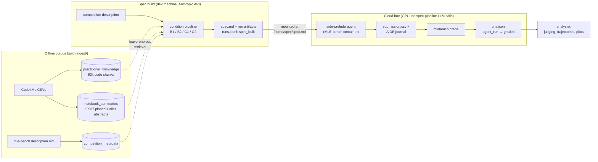
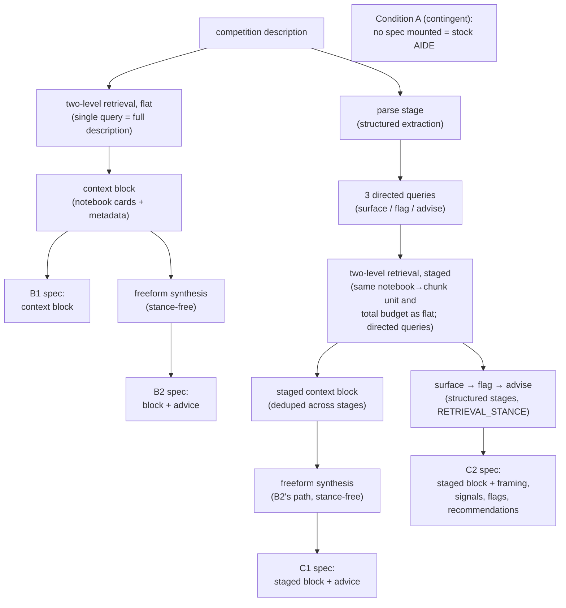

# Prelude — Research Design

*v1 scope. Drafted July 2026, before any evaluation run. Amendments after
runs begin must be dated and listed at the bottom.*

## Research question and hypothesis

**Question:** Does structured reasoning over retrieved prior work improve ML
agent performance on benchmark tasks beyond what unstructured knowledge
provision achieves?

**Falsifiable hypothesis (H1):** On MLE-bench Lite competitions, an AIDE
agent given Condition C2's structured specification will achieve a higher
Any-Medal rate than the same agent given Condition B's unstructured context.
H1 is falsified if C2 fails to separate from B beyond seed noise, or if
unstructured provision alone matches structured specification. *(Amended
2026-07-16, pre-run: H1 originally referenced the published no-assistance
baseline (A); that comparison is invalid because the published AIDE runs
used gpt-4o-2024-08-06, not our agent model — see the Condition A note
under the experimental design.)*

**Secondary hypothesis (H2, mechanistic):** C2's advantage, if any, is
mediated by specification flags being acted on — flag categories with higher
action rates (per the frozen judge rubric) contribute disproportionately to
outcome differences.

## Related work positioning

- **MLE-bench** (OpenAI, ICLR 2025): evaluation infrastructure and the
  Condition A baseline. Measures agent capability; does not study what
  knowledge or specification the agent starts with.
- **AssistedDS** (EMNLP 2025): showed LLMs adopt provided unstructured
  knowledge uncritically. Defines Condition B's design; does not test
  structured alternatives.
- **CatDB** (VLDB 2025): closest analog — catalog-grounded data-science
  automation. Assumes a populated catalog; does not address reasoning about
  unknown/missing signals, and provides no staged specification process.
- **Yang et al. 2023, "LLMs as Optimizers":** conceptual grounding for
  prompt-level structured reasoning; not applied to ML problem
  specification.

## System overview

The spec pipeline (left, laptop) and agent execution (right, cloud box)
never share a runtime: specs are serialized text by the time they reach the
container (core constraint 1). The append-only registry is the join —
spec-time entries from the dev machine, agent/grading entries from the box,
merged per run_key.

## Experimental design

Five conditions, structured as a 2 (retrieval: flat vs staged) × 3
(synthesis: none vs freeform vs structured-critical) grid with three cells
built plus one grid-external anchor:

| Condition | Retrieval | Synthesis | Isolates (vs) |
|---|---|---|---|
| A | none | none | no-assistance anchor — matched agent, contingent arm (see note) |
| B1 | flat, single query | none — raw context block | knowledge provision per se (vs A) |
| B2 | flat, single query | freeform, stance-free | LLM preprocessing (vs B1) |
| C1 | staged, 4 directed queries | freeform, stance-free (B2's path) | staged retrieval (vs B2) |
| C2 | staged, 4 directed queries | structured schemas + critical-integration stance | synthesis structure (vs C1) |

Per-condition workflow — every arrow into a spec is one grid step's single
change:

Design notes:

- **Condition A (decided 2026-07-16, pre-run):** the published MLE-bench
  AIDE baseline used `gpt-4o-2024-08-06` as the code model and is not
  model-matched to our runs — it is cited as context only and never
  compared statistically. A *matched* A exists for free in the harness:
  `aide-prelude` with no spec mounted is byte-identical to stock AIDE
  (same agent model, hardware, time/step budgets, mle-bench version).
  It is pre-registered as a **contingent arm**, not a primary condition:
  (a) infrastructure smoke runs execute unmounted `aide-prelude` and are
  registered and kept, giving a small matched-A anchor at zero marginal
  cost; (b) the full A arm (~30 runs, est. +$200–250) triggers only if
  C2 fails to separate from B, or any condition lands below the plausible
  no-assistance range — the outcomes under which "is retrieval beneficial
  at all, or detrimental?" becomes load-bearing for interpretation. The
  core research question (structured decomposition + directed retrieval
  vs naive provision) is carried by the B/C contrasts and does not
  require A.
- **Retrieval unit held constant.** All conditions receive practitioner
  knowledge as "notebook cards" (top-M chunks from each of N notebooks
  surfaced via a summaries index) plus flat competition-metadata chunks.
  B selects notebooks with one flat query; C1/C2 with four stage-directed
  queries. This confines the flat-vs-staged contrast to query structure
  rather than retrieval granularity.
- **Document budgets parity-matched** via `pipeline/config.py` (B's flat
  budget = staged conditions' total). Exact values are calibration
  parameters, not design constants.
- **C1 runs parse's structured extraction** (task type, metric, goal) solely
  to build the directed queries — its synthesis input is description +
  context block only, identical in form to B2's. This is inherent to
  "staged": directed queries must be directed by something.
- **C1 is a pilot condition:** 3–4 competitions, single seed, not the full
  matrix. Built to run at full scale; the harness defaults to the pilot
  subset.
- AIDE scaffold, agent model, and MLE-bench grading are held constant across
  all run conditions.
- **Spec-pipeline eval model pinned (2026-07-19):** `EVAL_MODEL =
  claude-sonnet-5` (`pipeline/config.py`) for all eval-run spec builds;
  distinct from the AIDE agent-model pin, which is finalized on-box per the
  aideml-support note (2026-07-17) before eval runs.

## Corpus construction

- **Current dev corpus:** Code4ML filtered to MLE-bench Lite-22 competitions
  — 62,379 code chunks (deduped from 132,796 cell-level blocks), 1,005
  competition-metadata chunks (1,156 Code4ML descriptions + 22 mle-bench
  `description.md`), plus a `notebook_summaries` collection (one abstract
  per unique notebook) as level one of two-level retrieval. Summaries are
  corpus infrastructure, generated by a pinned model (Haiku,
  `summary_model` stamped in metadata) shared identically across all
  conditions — exempt from the Haiku-dev/Sonnet-eval switch because summary
  quality affects retrieval uniformly and cannot confound between-condition
  comparisons.
- **Planned before production runs:** expansion to full Code4ML (~2.74M
  blocks, ~1,150 competitions; the Lite slice is ~5%) and MLEModernizer
  (107 GB replication package — cloud-box ingestion, separate swap).
- **Leave-one-out:** every retrieval carries
  `competition_id != current_competition`, enforced inside the retrieval
  seam (`pipeline/retriever.py`); for two-level retrieval the filter applies
  at the notebook level, which subsumes the chunk level. A code path
  bypassing this filter is solution leakage (CLAUDE.md core constraint 5).
- **Two-level rationale:** flat chunk retrieval returns decontextualized
  fragments from arbitrary notebooks; notebook-then-chunk retrieval returns
  coherent excerpt groups from notebooks selected as wholes, and lets
  retrieval reason at the level practitioners work at (a notebook is an
  approach; a chunk is a step).

## Outcome metrics (defined in advance)

**Primary:** Any-Medal rate (MLE-bench grading), mean ± one standard error
across 3 seeds per competition. Acknowledged as low-powered at n≈10
competitions; treated as directional, not confirmatory.

**Secondary (higher resolution):**
1. Leaderboard percentile of the final submission
2. Valid-submission rate (fraction of runs producing a gradeable submission)
3. Time-to-first-valid-submission (wall-clock within the AIDE run)

**Cost/efficiency accounting (added 2026-07-17, pre-run):** every run
carries a two-sided ledger linking upfront specification cost to downstream
agent behavior, answering whether C's additional spec-build LLM calls save
agent cycles relative to B:

- *Spec side* (registry + `llm_usage.json` per run artifact): build
  wall-clock, LLM call count, input/output tokens — per call, in stage
  order, so per-stage attribution is free.
- *Agent side* (registry via `harness.advance`, journal preserved as the
  trajectory artifact): run wall-clock, AIDE steps used,
  time-to-first-valid-submission, and per-step score/time curves derived
  from the AIDE journal — enabling trajectory comparison across conditions
  and problem types. Per-step agent *token* usage is not in AIDE's journal
  by default; a behavior-neutral logging patch to the aide-prelude variant
  (identical across all conditions) is a noted container-side follow-up.

## Mechanistic evaluation

Per-flag flag→action→outcome judging against the **frozen rubric**
(`docs/JUDGE_RUBRIC.md`; frozen before any run, amendment-controlled):
each `SpecificationFlag` from a C2 run is classified `not_acted_on` /
`acted_on_unclear` / `acted_on_positive` by an LLM judge
(`analysis/judge.py`) that sees the solution artifacts but never the score.
Aggregation per category: detection rate, action rate, outcome
contribution, and retrieval-grounded fraction (non-empty
`evidence_doc_ids`). Requires the artifact preservation layout in
`analysis/artifacts.py`.

## Threats to validity

- **Construct validity (acknowledged, central):** Kaggle competitions are
  *pre-specified by construction* — task, metric, and data are given, which
  limits the available specification-failure signal that Prelude is designed
  to catch in production settings. Mitigation: competition selection favors
  Lite competitions with known data quirks (leakage paths, temporal
  structure, measurement gaps). A synthetic-corruption arm (deliberately
  under-specified task descriptions) is named as future work, not current
  scope. Consequently, any effect measured here is interpreted as a
  conservative lower bound on the expected improvement in the
  ambiguously-specified real-world settings Prelude targets: the framing
  portion of the C2 specification largely restates what Kaggle already
  makes explicit, so the measurable signal is confined to flags and
  recommendations.
- **Budget/attention confounds:** document budgets are parity-matched; token
  counts of injected artifacts are logged per run and reported, split into
  retrieved-block vs synthesis-artifact tokens so "more retrieved knowledge"
  is distinguishable from "structured restatement of the same knowledge."
  *Similarity threshold evaluated and rejected pre-run (2026-07-15):* a
  10-competition calibration sweep (`analysis/calibration.py`,
  `results/calibration/`) showed the stage-directed queries score ~0.06
  lower than the flat query against the identical chunk collection (short
  keyword queries vs full-description queries — query impoverishment, not a
  text/code modality gap), so any global cutoff filters the staged
  conditions roughly twice as hard as flat retrieval and breaks knowledge
  parity. `SIMILARITY_THRESHOLD=None` for v1: budgets bound quantity,
  top-k rank ordering supplies quality control. Revisit triggers: evidence
  of junk retrievals in run inspection (then: tail-relevance judging, and
  per-kind quantile floors derived by a uniform documented rule), or corpus
  expansion (re-run the sweep — thresholds are corpus-relative).
- **Judge circularity:** rubric frozen pre-run; judge blinded to outcomes;
  evidence quotes required.
- **Corpus coverage asymmetry:** 18/22 Lite competitions have practitioner
  notebooks; retrieved-doc counts are reported per competition per
  condition as descriptive statistics.
- **Low n:** primary metric is directional; secondary metrics and
  mechanistic analysis carry the evidential weight.

## Roadmap

**v1 (this design):** everything above — B1/B2/C1-pilot/C2 on ~10 Lite
competitions, 3 seeds (1 for C1 pilot), mechanistic judging, writeup.

**v2 (explicitly out of scope):** MLE-Dojo / interactive specification
reasoning; iteration depth as an experimental variable; real
organizational-corpus case study; synthetic-corruption arm.

## Amendments

(none)
